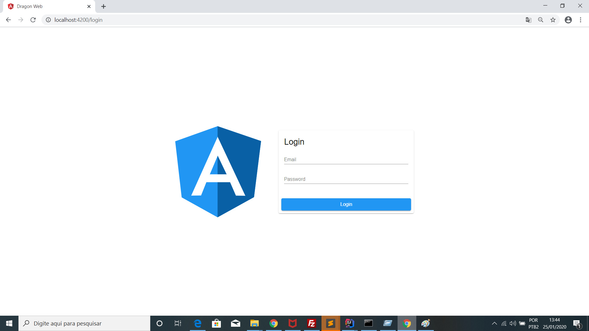
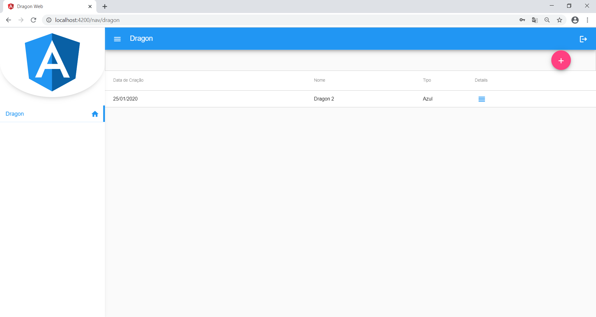
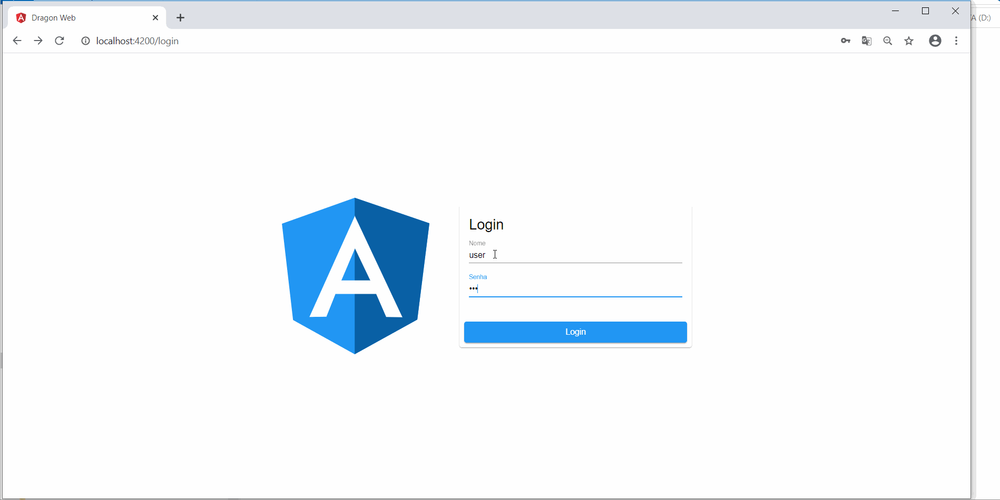

# Dragon-Web
Olá seja bem vindo ao sistema Dragon WEB. \
O projeto foi desenvolvido em Angular 8, e as requisições REST foram feito
através da API `rxjs`, os detalhes desta biblioteca pode ser visto no site [angular.io](https://angular.io/guide/rx-library).

Para fazer o login use as seguintes credenciais:

nome: user \
senha: user

## Execução
Após fazer o download do projeto faça o seguinte comando: 

````
npm install
````


E para iniciar o sistema faça a seguinte instrução:

 ````
   ng serve 
 ````


O sistema irá levantar na porta 4200


## Descrição
O Projeto Dragon tem uma página de login e uma página de listagem de dragões.
A listagem de nomes estão em ordem alfabética. 
A partir da lista, deverá ser possível remover e alterar as informações dos dragões.
E na página de detalhes são exibo as seguintes informações:


* Data de criação; 
* Nome; 
* Tipo; 

Também é possível cadastrar um novo dragão.

## Screenshots
Página de Login



 Listagem
 


Video


###


